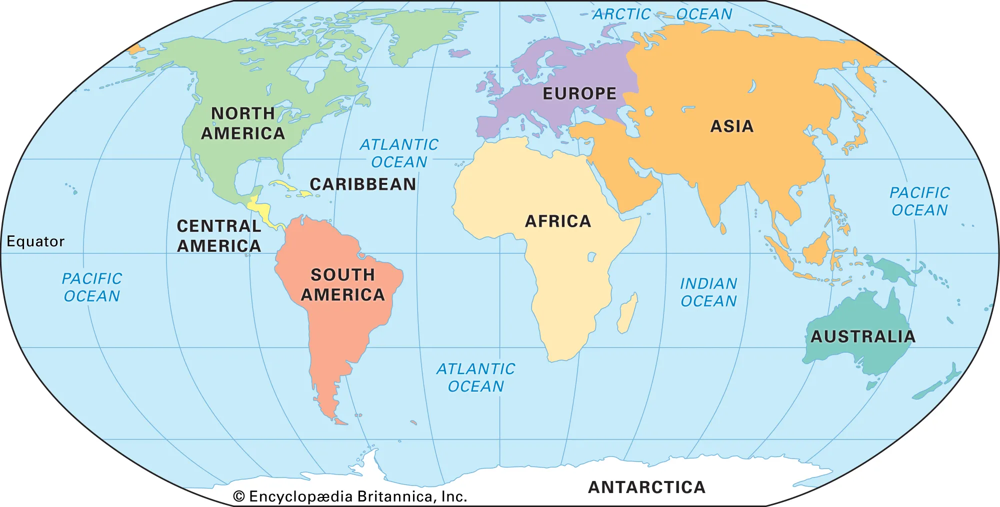
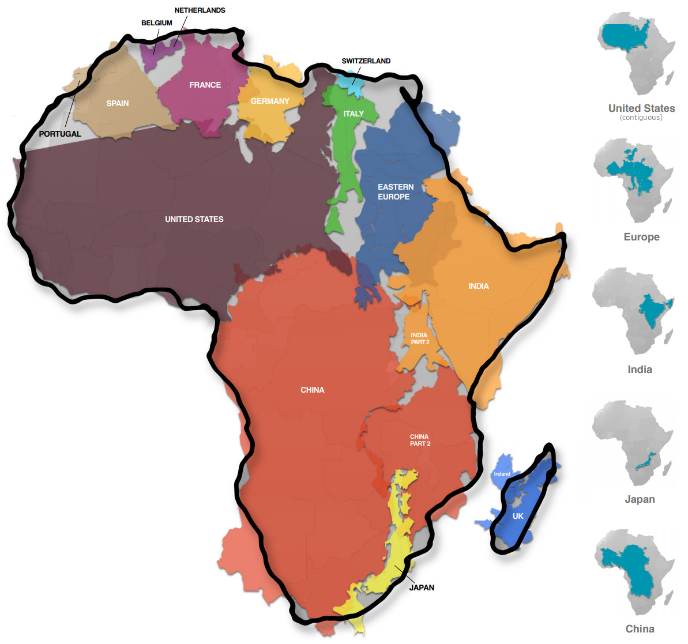

For Lab 1, you should submit your solutions to Canvas as a `.pdf` and include your *RMarkdown* syntax (i.e., you can render an html file or push your code to GitHub, or share the .Rmd file). Please see the *Preparing Lab Reports* section at the bottom of this assignment.

Your file name should read: FirstName_LastName_Lab1.Rmd

## Learning Objectives

In this lab, you will be introduced to the `dplyr` package, which is one of the many packages in the [`tidyverse`](https://www.tidyverse.org/). The `tidyverse` is a set of packages that will be used for cleaning and organizing data.

This lab will teach you how to use functions in `dplyr` to manipulate variables and data frames. You will also learn some base-R functions to conduct univariate analysis in the RStudio IDE.

------------------------------------------------------------------------

## Learning Activities

By the end of this lab you will be able to:

1.  Install and/or update R packages
2.  Assign data frames to different names for efficient exploration
3.  Generate a set of outputs using the [`dplyr`](https://dplyr.tidyverse.org/) package
4.  Overwrite a data frame while using the [pipe operator](https://style.tidyverse.org/pipes.html)
5.  Produce simple plots using data located in an `R` package

## Developing a workflow

Coding workflows are an essential component of project completion.

When analyzing data, it is important to understand the possible intersections between the `context`, `content`, and `code`. The best way to explore these relationships is by conducting a literature review. Reading about what others have done is more valuable than starting a workflow prematurely.

Time may be used inefficiently and clear but standard outputs provide narratives that can likely be confirmed by or support what is already in the research literature. Without an understanding of these connections, analytic outputs may do less to move our understanding of issues forward.

This lab will help you explore and create your own workflow. The goal of a coding workflow is not to simply `copy` and `paste` arguments that you find. Instead, you want to develop clear pathways to identifying solutions as you work with your data.

The topics in Lab 1 cover one way to approach a new data set. In this lab, you'll cover how to load data from a package, generate a set of outputs using small code chunks, and produce and submit a few simple plots.

You will submit your final output on Canvas [here](https://canvas.howard.edu/courses/55030).

------------------------------------------------------------------------

# Part 0: Pre-lab tasks

-   Check your working directory

-   Start a new R Script

-   Write a preamble

-   Install and/or update packages and load libraries

## Task 0.1: Check your working directory

In your console, type in the following code to ensure you are in the desired directory:

```{r}
#| echo: true
#| output: false
#| warning: false
getwd()
```

If you are not in the desired directory, you can change your directory using the associated path. This path should be the same as the project folder that you plan to work out of and set up in lecture five.

```{r}
#| echo: true
#| output: false
#| warning: false
# insert your desired path in the parenthesis and remove the #
# setwd("/your/working/directory/goes/here") 
```

You can add a new sub-folder manually or under the **Files** tab in the RStudio IDE.

## Task 0.2: Start a new RMarkdown file

Once you have confirmed that you are in the correct directory, start a new RMarkdown file (.Rmd) and write your preamble.

```{r}
#| echo: true
#| output: false
#| warning: false

# ---
# title: "Lab 1"
# author: "Your Full Name"
# date: "2024-09-09"
# output:
#   pdf_document: default
#   html_document:
#     theme: flatly
# editor_options:
#   markdown:
#     wrap: sentence
# ---

```

## Task 0.3: Write setup code chunks

```{r}
#| echo: true
#| output: false
#| warning: false

# ```{r, eval=F}
# install.packages("devtools")
# library(devtools)
```

## Task 0.4: Packages and libraries

```{r}
#| echo: true
#| output: false
#| warning: false

# install package
install.packages("tidyverse", repos = "http://cran.us.r-project.org")
install.packages("remotes", repos = "http://cran.us.r-project.org")
 
# load the necessary libraries
library(tidyverse) #collection of R packages designed for data science
library(here) #helps with filepaths
library(tidyverse)
library(dplyr)
library(remotes)

here::i_am("lab1.qmd")
```

The `dplyr` package supports data analyst with efficient data manipulation. As a part of the `tidyverse` package, the functions included in `dplyr` we loaded earlier will help you generate efficient workflows. Though, in reality, most analysts transition between classic code found widely on the internet and the more recent `dplyr` commands.

The `remotes` library will allow you to remotely install `critstats` data.

------------------------------------------------------------------------

# Part 1: The true size of Africa

In this part of the lab, you will complete the following tasks:

-   Explore notes on the social politics of maps

-   Examine the `true_size` data in the `critstats` package

-   Construct a response to the issue of misrepresentation in maps

{width="50%"}

## Task 1.1: Explore notes on the social politics of maps

-   [What is a map?](https://education.nationalgeographic.org/resource/map/#:~:text=Maps%20present%20information%20about%20the,features%2C%20and%20distances%20between%20places) This *National Geographic* education resource presents a clear overview of maps, geography, and Geographic Information Systems (GIS).

-   [What's the real size of Africa?](https://www.cnn.com/2016/08/18/africa/real-size-of-africa/index.html) is a CNN Africa Marketplace article that examines the Western foundations of maps and representations of the African continent.

-   [Vaughan (2018)](https://www.jstor.org/stable/j.ctv550dcj) is an open access publication on the *spatial dimensions of social cartography*. The text contains valuable information about how maps have been used to understand health and human development issues, such as poverty, disease, housing, and the like. The text also contains notes on race and nationality, crime and disorder, and a host of references for further reading.

-   [Manson & Matson (2017)](https://open.lib.umn.edu/mapping/chapter/1-maps-society-and-technology/) present an overview of society and mapping with new technological tools. While doing so, the authors provide a history of maps and examine the basic social elements of maps, the technical elements of maps, and how maps have been integrated into liberal arts education.

-   [Crampton (2015)](https://press.uchicago.edu/books/HOC/HOC_V6/HOC_VOLUME6_R.pdf) writes on *Maps and the Social Construction of Race* in a larger volume on maps produced by the University of Chicago Press.

-   [Alderman & Inwood (2021)](https://theconversation.com/how-black-cartographers-put-racism-on-the-map-of-america-155081) describe how Black cartographers use maps to examine issues of racial inequality. The authors provide a more focused discussion on the social politics of maps, as opposed to a more general overview of their functions.

-   [Can maps be racist?](https://sociologyinfocus.com/your-map-is-racist-and-heres-how-2/) Palmer (2014) provides some context to understand the technical aspects of maps as they relate to our social construction of the global world. In this review, the author situates the common functions of maps onto the social dimensions while attending to the particular periods of the development and construction of global maps; thus integrating the political dimension of knowledge creation via map making.

    -- [Britton (2021)](https://areomagazine.com/2021/03/08/in-defence-of-the-mercator-projection-the-non-racism-of-maps/) in a blog post on the "non-racism of maps" offers a very different perspective on the Mercator projection. The author focuses on ideology and science in modern society. He argues that the original purpose of maps does not make them racist.

-   [How maps distort our perception of the world](https://the-ard.com/2023/06/09/the-mercator-projection-and-how-maps-distort-the-world/) is a short and focused resource written by Lee (2023) on the Anti-Racism Daily site. The author focuses on the social politics of perception.

{width="75%"}

## Task 1.2: Load the `true_size` data

### Task 1.2.1: Install the `critstats` package

To begin, we will install and/or update the installation of `critstats`.

```{r}
#| echo: true
#| output: false
#| warning: false
# use the remote install function to call in your data
remotes::install_github("professornaite/critstats", force=TRUE)

# load the `critstats` library
library(critstats)

# update the `critstats` package if needed
# update.packages("critstats")
```

### Task 1.2.2: Call the `true_size` data

```{r}
#| output: false
true_size
```

### Task 1.2.3: Inspect the `true_size` documentation

Using the `??data` prompt, you can inspect the contents of the data frame.

```{r}
??true_size
```

As noted before, this serves as the data's documentation and is the basis of a code book (or codebook). A codebook contains very specific details about a database, data set, and the variables each contains. We will explore codebooks more in the future.

------------------------------------------------------------------------

## Task 1.3: Explore the `true_size` data

### Task 1.3.1: Assign the `true_size` data frame to `df1`

Use the assignment operator to assign the `true_size` data frame to the object `df1`.

```{r}
df1 <- true_size
```

### Task 1.3.2: Inspect your data

Use the `str()` function to inspect your data frame.

`str()` displays the structure of R objects.

```{r}
str(df1)
```

You can also run similar commands separately:

#### Task 1.3.2a: `dim()`

Use the `dim()` function to check the dimensions of your data.

```{r}
# check the dimensions of your data
dim(df1)
```

Note that the dimensions are reported as a $n \times m$ matrix with $n$ rows and $m$ columns.

#### Task 1.3.2b: `view()`

Use the `view()` function to see all of your data in a separate window.

```{r}
# view the data
view(df1)
```

#### Task 1.3.2c: `glimpse()`

Take a glimpse of your data using the `glimpse()` function.

```{r}
# get a glimpse of your data frame
glimpse(df1)
```

#### Task 1.3.2d: `head()`

View the first six observations in your data using the `head()` function.

```{r}
# view the "top" of your data
head(df1)
```

#### Task 1.3.2e: `tail()`

View the last six observations in your data using the `tail()` function.

```{r}
# view the "bottom" of your data
tail(df1)
```

#### Task 1.3.2f: Specify `n` in `head()` or `tail()`

You can change the number of observations viewed by being more explicit in your code.

```{r}
head(df1, n = 10) # view the top 10 observations
tail(df1, n = 3) # view the bottom 3 observations
```

#### Task 1.3.2g: `summary()`

Get a summary of all variables in the data set.

```{r}
# get a summary of your data frame
summary(df1)
```

------------------------------------------------------------------------

## Task 1.4: Use `dplyr` verbs on `true_size`

In this section, we will review the `dplyr` verbs that help us get our data into a format that works for our analysis. These verbs can be used in any order. We can also use the pipe operator `%>%` and use multiple verbs in a single code chunk.

### Task 1.4.1: Subset columns (variables) using `select()`

The `select()` command retains only those columns that are listed.

It uses the logic `select(data, variable1, variable2, ...)`.

```{r}
# keep only the Country and percent.africa columns
select(df1, Country, percent.africa) 

# keep only the Country and area.sq.mi columns
select(df1, Country, area.sq.mi)
```

We can also subset columns by deleting others

To do so, we use a minus sign ahead of the column names.

```{r}
# remove the area.sq.mi variable
select(df1, -area.sq.km)

# remove the listed variables in the data frame
select(df1, -area.sq.km, -area.sq.mi) 
```

### Task 1.4.2: Filter rows (cases) using `filter()`

`filter()` allows us to select rows based on specific criteria.

```{r}
# keep only those rows where the percent.africa value is grater than 30
filter(df1, percent.africa > 30)

# keep only those rows where the percent.africa value is less than 1
filter(df1, percent.africa < 1)

# keep only those rows where percent.africa is less than 10 and greater than 1
filter(df1, percent.africa < 10 & percent.africa > 1)

# keep only those rows where Country is equal to "China"
filter(df1, Country == "China")
```

Notice the use of a `==` equal sign when referencing a cell's value. This will become an important component of base logic and analysis when writing code.

### Task 1.4.3: Add/remove columns (variables) using `mutate()`

We use `mutate()` to create new variables from existing variables.

It is not clear what `area.sq.mi` and `area.sq.km` refer to in our data. Further inspection and a bit of internet searching will show us that these values are in the millions and that they represent estimates.

We can transform these as follows:

```{r}
# add a new column with a more accurate label for land area estimate (sq mi)
mutate(df1, est.square.miles = df1$area.sq.mi * 1000000) 
```

#### Task 1.4.3a: Add new variables using the pipe `%>%`

We can also use the `pipe` operator to mutate the variable.

```{r}
# we can create the same output when using the %>% (pipe)
df1 %>%
  mutate(est.square.miles = df1$area.sq.mi * 1000000) 

# add a new column with a more accurate label for land area estimate (sq km)
df1 %>% 
  mutate(est.square.km = df1$area.sq.km * 1000000)
```

#### Task 1.4.3b: Add new variables and remove old variables

It is easiest to put all of the verbs together in a single chunk of code.

```{r}
# remove the old column; use the pipe command to do both operations at once
df1 %>%
  mutate(est.square.miles = df1$area.sq.mi * 1000000) %>% 
  mutate(est.square.km = df1$area.sq.km * 1000000) %>% 
  select(-area.sq.mi, -area.sq.km) # remove the columns we do not want
```

These values seem to represent the data more clearly.

### Task 1.4.4: Rename a column using `rename()`

We can also use `rename()` to modify a column's label.

```{r}
df1 %>%
  mutate(est.square.miles = df1$area.sq.mi * 1000000) %>% 
  mutate(est.square.km = df1$area.sq.km * 1000000) %>% 
  select(-area.sq.mi, -area.sq.km)  %>% 
  rename(country = Country)  # make the 'C' in country lowercase
```

### Task 1.4.5: Use `relocate()` to reorder the columns

```{r}
df1 %>%
  mutate(est.square.miles = df1$area.sq.mi * 1000000) %>% 
  mutate(est.square.km = df1$area.sq.km * 1000000) %>% 
  select(-area.sq.mi, -area.sq.km)  %>% 
  rename(country = Country) %>% 
  relocate(country, percent.africa, est.square.miles) # reorder the columns
```

### Task 1.4.6: Overwrite your data frame

Now that we've restructured the data into a format that is more accurate, we can reassign our data frame using the pipe operator. Take note of how the code is built with new commands starting on a new line and ending with the `%>%` operator.

```{r}
true_size_modified <- df1 %>%
  mutate(est.square.miles = df1$area.sq.mi * 1000000) %>% 
  mutate(est.square.km = df1$area.sq.km * 1000000) %>% 
  select(-area.sq.mi, -area.sq.km)  %>% 
  rename(country = Country) %>% 
  relocate(country, percent.africa, est.square.miles) # reorder the columns
```

Now view your modified data frame.

```{r}
true_size_modified
```

### Task 1.4.7: Explore `summarise()`, `arrange()`, and other verbs

There are other verbs in the `dplyr` package.

For example, we will use the `summarise()` and `arrange()` commands in the next part of the lab.

You can learn more about other `dplyr` data transformations [here](https://github.com/rstudio/cheatsheets/blob/main/data-transformation.pdf).

------------------------------------------------------------------------

Now that you have a few tools to explore and modify data frames, we return to the `africa_data_all` data in the `critstats` package. We will use this data frame to work more with `dplyr` and explore univariate analyses.

------------------------------------------------------------------------

# Part 2: Univariate analysis

In this part of the lab, you will complete the following tasks:

-   Examine the `africa_data_all` data in the `critstats` package

    -- Create a table of the number of observations by year

    -- Gather summary statistics for all variables by year

    -- Create separate data frames for each year

-   Compute univariate statistics for the year 2020 in `africa_data_all`

## Task 2.1: Load the `africa_data_all` data

The `africa_data_all` data set will be used for instructional purposes only.

The data in this data frame was collected from the internet.

The data frame contains data on African countries and territories for two years: 2020 and 2023.

### Task 2.1.1: Call the `africa_data_all` data

We begin by taking a look at the data.

```{r}
#| echo: true
#| output: false
africa_data_all 
```

What are some of your early observations?

### Task 2.1.2: Inspect `africa_data_all` documentation

The documentation can help us get a better idea of the data frame's content.

```{r}
#| echo: true
#| output: false
??africa_data_all 
```

If, by chance, you cannot load the documentation or experience issues with the `critstats` data package, you may need to restart your RStudio session.

## Task 2.2: Prepare the `africa_data_all` data

To be efficient, we will only use specific functions to explore the data set.

Please note that there are many other approaches to exploration.

The approach taken below is one of many possibiliites.

### Task 2.2.1: Assign `africa_data_all` to df2

Use the assignment operator to assign the `africa_data_all` data frame to the object df2.

```{r}
df2 <- africa_data_all
```

We can now work more efficiently by typing `df2` when we want to call the data frame. Notice that I did not overwrite `df1` in the event you want to return to Part 1 of this lab.

### Task 2.2.2: Inspect your data

The str() function displays the structure of R objects.

```{r}
str(df2)
```

Use `head()` to view the "top" of your data.

```{r}
head(df2)
```

Use `tail()` to view the "bottom" of your data.

```{r}
tail(df2)
```

View your data using the `view()` command.

```{r}
view(df2)
```

Get a summary of your data with `summary()`.

```{r}
summary(df2)
```

Take note of the content and values of the data and its structure.

## Task 2.3: Examine the data in detail

Before starting any analyses, we want to make sure we really understand our data.

You may have noticed that there is a `year` variable in the data set.

Specifically, the variable `year` separates the 2020 and 2023 data.

### Task 2.3.1: Make a table of a single variable's contents

To examine how many data values are listed by year we can use `table()`.

```{r}
# create a table of the number of observations by year
table(df2$year)
```

We notice 58 values for each year. What does this say about our data?

### Task 2.3.2: Gather summary statistics for the data by year

There are different ways to gather summary statistics by year.

I can nest the request using some logic and the year 2020 as follows:

```{r}
summary(filter(df2, year == 2020))
```

Consider why `filter(summary(df2, year == 2020))` returns an error.

We can also use the `%>%` operator to list the commands in order for 2020.

```{r}
# gather summary statistics for all variables for year == 2020
df2 %>% 
  filter(year == 2020) %>% 
  summary()
```

We can use the same commands to filter the data for 2023.

```{r}
# gather summary statistics for all variables for year == 2023
df2 %>% 
  filter(year == 2023) %>% 
  summary()
```

## Task 2.4: Get univariate statistics

To help advance our understanding of statistical analyses in the RStudio IDE, we will lean a few tasks to compute univariate statistics. You are likely familiar with univariate statistics. Univariate statistics are statistics done on a single variable. Some base R functions for univariate statistics are as follows:

-   `mean()` returns the mean of a single numeric variable

-   `median()` returns the middle value of a single numeric variable

-   `mode()` returns the variable type for the mode of a single variable

-   `table()` returns a frequency table with counts of each level for a single variable

-   `max()` returns the maximum value of a single numeric variable

-   `min()` returns the minimum value of a single numeric variable

-   `range()` returns the `min()` and `max()` values of a single numeric variable

-   `IQR()` returns the interquartile range values for a single numeric variable

-   `sd()` returns the standard deviation for a single numeric variable

-   `boxplot()` returns a boxplot of a numeric variable or variables

-   `hist()` returns a histogram of a single numeric variable

-   `stem()` provides a stem-and-leaf plot when a single numeric variable is input.

-   `plot()` provides a scatter plot of data values by its index, $i$.

-   `plot(density())` provides a density plot of a single numeric variable

Each of the above functions provides a different perspective on the distribution of values for a single variable.

### Task 2.4.1: Inspect data prior to analysis

From our earlier observations, we see that the `africa_data_all` (`df2`) contains data across two years: 2020 and 2023. Let's use pipes `%>%` to create separate data from for each year.

```{r}
# create a separate data frame for 2020
data_2020 <- df2 %>% 
  filter(year == 2020)

data_2020 # view the data for 2020
```

It is not clear that this data is for 2020. As a result, we can reorganize the columns and overwrite the data frame.

I am moving the `year` variable to the second position in the data frame.

```{r}
data_2020 <- df2 %>% 
  filter(year == 2020) %>% 
  relocate(country, year)

data_2020 # view the data for 2020
```

We can run the same functions for `year == 2023`.

```{r}
# create a separate data frame for 2023
data_2023 <- df2 %>% 
  filter(year == 2023) %>% 
  relocate(country, year)

data_2023 # view the data for 2023
```

It is now clearer which year we are loading when we view the data frames.

### Task 2.4.1a: Check for missing data

We can check the entire data frame for missing values using `is.na()`.

```{r}
#| output: false
is.na(data_2020)

is.na(data_2023)
```

You can see that this output is far too extensive.

We should check for missing values for a specific variable first.

Let's use the `migrants` variable in the `df2` data frame by inserting `df2$migrants`.

The code to check for missing values in the 2020 data frame for the variable `migrant` is as follows:

```{r}
is.na(data_2020$migrants)
```

Notice that there is a missing value for the variable `migrant` in the 2020 data.

It may be important to see the total number of missing values in the data frame. We can check the number of missing values for each variable using `sapply()`. The `sapply()` is a base-R function and it is used for different purposes. Here is an example:

```{r}
sapply(data_2020, function(x) sum(is.na(x)))
```

`sapply()` is a loop function and the above code iterates the function for each variable in the `df2` data set.

The logic of the function is `sapply(data, FUNction...)`.

From the output, we notice that a few different variables have a missing value.

You can use the `view()` function to take a closer look at the data to find the missing values.

What do you notice about the source of the missing values when using `view()`?

### Task 2.4.1b: Working with missing values

In class, we will learn how to deal with missing values. For now, you can remove missing values using the code below or select those variables that has no missing values for your lab reports.

When conducting univariate statistics, we can simply tell R to ignore missing values.

```{r}
# mean returns `NA` since there are missing values
mean(data_2020$migrants)
```

Use `na.rm = TRUE` to remove missing values from a numeric variable

```{r}
# instruct R to remove missing values from the analysis using `
mean(data_2020$migrants, na.rm = TRUE)
```

There are some exceptions here and it relates to the type of variable being used. We'll explore missing values in class.

------------------------------------------------------------------------

For our next set of tasks, we will focus on variables in the `data_2020` data frame.

Recall that `data_2020` was used as a label for `africa_data_all` when `year == 2020`.

### Task 2.4.2: `mean()`

The `mean()` function returns the mean of a single numeric variable.

```{r}
# find the average population in 2020
mean(data_2020$pop)

# find the average percent urban population in 2020
mean(data_2020$urban.pop)

# find the average of median age in 2020
mean(data_2020$med.age)
```

Notice that the last command returns `NA` due to missing values.

We can correct this by using `na.rm = TRUE`.

```{r}
# check to see missing data in the variable
is.na(data_2020$med.age)

# compute the mean using the na.rm = TRUE
mean(data_2020$med.age, na.rm = TRUE)
```

### Task 2.4.3: `median()`

The `median()` function returns the middle value of a single numeric variable.

```{r}
median(data_2020$pop)
```

We can also use pipe operators to filter the countries that are above and below the `median` values.

```{r}
# filter data to show countries that are below the median
data_2020 %>% 
  filter(pop < median(pop)) %>% 
  select(country, pop)

# filter data to show countries that are above the median
data_2020 %>% 
  filter(pop > median(pop)) %>% 
  select(country, pop)
```

### Task 2.4.4: `mode()` and `table()`

The `mode()` function returns the variable type for the mode of a single variable.

```{r}
# what does this output tell us about the mode of the med.age variable?
mode(data_2020$med.age) 
```

We can use the `table()` function to get our mode.

The `table()` function returns a frequency table with counts of each level for a single variable.

```{r}
# what does this updated output tell us about the mode of the med.age variable?
table(data_2020$med.age) 
```

### Task 2.4.5: `max()` and `min()`

The `max()` function returns the maximum value of a single numeric variable.

```{r}
# get the maximum value
max(data_2020$pop)

# use pipes to gather details about which country or territory has the max value
data_2020 %>% 
  filter(pop == max(pop)) %>% 
  select(country, pop)
```

The `min()` function returns the minimum value of a single numeric variable.

```{r}
# get the minimum value
min(data_2020$pop)

# use pipes to gather details about which country or territory has the min value
data_2020 %>% 
  filter(pop == min(pop)) %>% 
  select(country, pop)
```

### Task 2.4.6: `range()`

The `range()` function returns the min() and max() values of a single numeric variable.

```{r}
range(data_2020$pop)
```

However, we can manually compute the `range` by using arithmetic with our functions.

```{r}
# generate a new variable call population range that is the maximum minus the minimum value
pop_range_2020 <- max(data_2020$pop) - min(data_2020$pop)
pop_range_2020 # we must call the object back to see its value
```

### Task 2.4.7: `IQR()`

```{r}
# find the IQR for the 2020 population variable
IQR(data_2020$pop)

# find the IQR for the 2020 percent urban population variable
IQR(data_2020$urban.pop)
```

### Task 2.4.8: `sd()`

The `sd()` function returns the standard deviation for a single numeric variable.

```{r}
# find the standard deviation of the 2020 population variable
sd(data_2020$pop)

# find the standard deviation of the 2020 urban population variable
sd(data_2020$urban.pop)
```

### Task 2.4.8: Use `summary()`

The `summary()` function is often more efficient for a quick check of univariate statistics.

```{r}
summary(data_2020)
```

Not, however, the values that `summary()` returns and those that it does not. While the function can be used to be more efficient, it should not replace a thorough inspection of your data. We will discuss this more in exploratory data anlaysis.

## Task 2.5: Create basic plots

### Task 2.5.1: `boxplot()`

`boxplot()` returns a box plot of a numeric variable or variables.

```{r}
boxplot(data_2020$pop)
```

### Task 2.5.2: `hist()`

`hist()` returns a histogram of a single numeric variable.

```{r}
hist(data_2020$pop)
```

### Task 2.5.3: `stem()`

`stem()` provides a stem-and-leaf plot when a single numeric variable is input.

```{r}
stem(data_2020$med.age)
```

### Task 2.5.4: `plot()`

`plot()` provides a scatter plot of data values by its index, $i$.

```{r}
plot(data_2020$med.age)
```

### Task 2.5.5: `plot(density())`

`plot(density())` provides a density plot of a single numeric variable

```{r}
plot(density(data_2020$pop))
```

------------------------------------------------------------------------

# Preparing Lab Reports

Labs contain **Reports**.

In this way, we have *lab reports*.

**Reports**, as the name may suggest, are meant to help you report out your own workflow.

Developing your own workflow is an important part of statistical analysis. Your workflow and reports should **not** be a `copy` and `paste` of the exact code outlined in a lab's examples. That said, most examples and the code used are specifically designed to help us move efficiently through the materials for this course.

Note: The use of internet resources like `Chat GPT` are discouraged when generating code. If an assignment is submitted after using any AI assisted software, there may be an issue with plagiarism. All code for our course is self-contained, and it should not require that you search for long hours to find a solution; all solutions are somewhere on our course site!

### Submission

Please complete the following reporting tasks for each part of the Lab 1 assignment.

You will submit your reports as a PDF using what is called an *RMarkdown* file `(.Rmd)`.

For Lab 1, you may submit your lab reports to Canvas in both PDF and the RMarkdown file.

------------------------------------------------------------------------

# Part 1 Reports

## Report 1.1

What are some of the main concepts in [Vaughan (2018)](https://www.jstor.org/stable/j.ctv550dcj)? Could the data in the `true_size` data be used to respond to and advance our understanding of the concepts in Vaughan (2018)? If so, how might it be used to examine both the social context (period) and historical consequences (uses) of inequity in map making? If not, explain.

## Report 1.2

If the data in `true_size_modified` is accurate, what is the expected correlation between the percent.africa and est.square.miles variables? Specifically, why do we get the below scatter plot based on the data values?

```{r}
#| echo: false
#| output: true
plot(percent.africa ~ est.square.miles, true_size_modified)
```

## Report 1.3

Based on the original values in the `true_size` data, is there enough information to confirm if the claims about the size of Africa and the social politics of maps is true? Explain why or why not.

## Report 1.4

Write code to add a new variable to the `true_size_modified` data called `proportion`.

Use `mutate()` and arithmetic to generate the new variable.

Hint: If $Y$ = `proportion`, then $y_i = \dfrac{x_i}{sum(x)}$ for some variable $X$ in data set.

```{r}
#| echo: false
#| output: true
true_size_modified %>% 
  mutate(proportion = est.square.miles/sum(est.square.miles)) %>% 
  glimpse() %>% 
  head() %>% 
  tail()
```

Overwrite `true_size_modified` with a new data framed titled `true_size_updated`.

You should be able to call the data as follows:

```{r}
#| echo: false
#| output: false
true_size_modified %>% 
  mutate(proportion = est.square.miles/sum(est.square.miles)) %>% 
  glimpse() %>% 
  head() %>% 
  tail()
```

```{r}
#| echo: false
#| output: false
true_size_updated <- true_size_modified %>% 
  mutate(proportion = est.square.miles/sum(est.square.miles))
true_size_updated
```

```{r}
#| echo: true
#| output: true
true_size_updated
```

## Report 1.5

To confirm that you have generated the new variable and overwritten the data frame, create the plot below using the following code. Be sure to add your first name and last name in the quotes.

The code should be verbatim with the exception of your name.

```{r}
#| echo: true
#| output: true
plot(true_size_updated$proportion, true_size_updated$percent.africa)
title("first.name last.name") # Add your first name and last name
```

For example, my code would read:

```{r}
#| echo: true
#| output: true
plot(true_size_updated$proportion, true_size_updated$percent.africa)
title("Nathan Alexander") # Add your first name and last name
```

Notice the use of quotes when using `title()` under a plot.

If you experience issues making the plot, it is likely that you have made an error in the previous steps. Remember that R is case sensitive in all instances, and space sensitive in some instances.

Please be sure to go back and carefully check your code.

\Large{Save this plot as a `pdf` and submit it with Lab 1 files on Canvas [here](https://canvas.howard.edu/courses/46792)}.

------------------------------------------------------------------------

# Part 2 Reports

## Report 1.6

State each variable and variable type in the `africa_data_all` data frame.

What code provides us with the requested information most efficiently?

## Report 1.7

Why does `filter(summary(df2, year == 2020))` return an error?

Recall that `df2` was used as a label for `africa_data_all`.

## Report 1.8

When using `view(data_2020)` after running the `sapply(data_2020, function(x) sum(is.na(x)))`, what do you notice? Specifically, what country (or territory) is the source of the missing data values?

Recall that `data_2020` was used as a label for `africa_data_all` when `year == 2020`.

## Report 1.9

Compute univariate statistics for two numeric variables in `africa_data_all` for `year == 2023`.

Univariate statistics for each variable should include: `mean()`, `median()`, a method to find the `mode` of the varaible, if it exists, `max()` and `min()`, a method to find the `range` of the varaible, `IQR()`, and `sd()`.

## Report 1.10

Create basic plots (i.e., `boxplot()`, `hist()`, `plot()`, and `plot(density())`) for the two numeric variables that you used in Report 1.9 (above). Add a title to each plot.

\Large{Save each plot as a `pdf` and submit it with Lab 1 files on Canvas [here](https://canvas.howard.edu/courses/46792)}.

# Experiencing issues?

If you experience issues executing your code, it is likely that you have made an error in the previous steps.

Remember that R is case sensitive in all instances, and space sensitive in some instances.

Please be sure to go back and carefully check your code.
